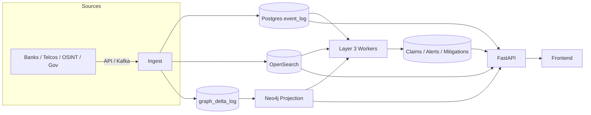

# Sentinel-KE

Sentinel-KE is an end-to-end cyber intelligence platform built in three layers:

- Layer 1: Evidence-grade ingestion into Postgres (canonical truth) + OpenSearch indexing
- Layer 2: Deterministic graph projection to Neo4j (derived view)
- Layer 3: Analytics workers (DDoS, VPN/infra correlation, fraud/mule campaigns, claims, mitigations, AI features)

The system is deterministic, explainable, and replayable. Postgres is always the source of truth.

## Core Principles

- Postgres is canonical; Neo4j is projection-only.
- All intelligence outputs are persisted to Postgres first.
- Graph projections are generated via GraphDelta logs.
- PII never enters the graph; sensitive identifiers are pseudonymized.
- Everything is replayable from the ledger.

## End-to-End Data Flow



## Quick Start (minimal)

1) Start the stack:
```
docker compose up -d
```

2) See the runbook for demo data, workers, and endpoint usage:
```
docs/RUNBOOK.md
```

## What’s Implemented

- Ingestion with strict validation and pseudonymization
- Event ledger and entity index in Postgres
- OpenSearch indexing + timeline/search APIs
- GraphDelta logging and Neo4j projection worker
- DDoS alert worker (structural signals)
- VPN/infra cluster worker (endpoint overlap + provider/time overlap)
- Fraud demo + mule-ring campaign worker (SIM swap -> login -> transfers -> cashout)
- Campaign claims + risk suggestions
- Mitigation/IOC bundles + export
- AI feature snapshots + embeddings + predictions + explanations (lightweight, deterministic)
- Metrics + readiness endpoints

## Repository Layout

- `backend/` FastAPI services, workers, ledger, graph projection
- `frontend/` UI
- `simulator/` demo data generator (scenarios)
- `docs/` runbook and operational notes

## Configuration

Key environment variables (see `.env`):

- `DATABASE_URL`
- `OPENSEARCH_HOST`, `OPENSEARCH_INDEX_EVENTS`
- `NEO4J_URI`, `NEO4J_USER`, `NEO4J_PASSWORD`
- `REDPANDA_BROKERS`
- `INGEST_API_KEY`
- `FRONTEND_API_KEY` (optional API auth key)

## Support

If the UI or workers are not producing alerts, verify:

- events exist in Postgres (`event_log`)
- OpenSearch index has docs
- GraphDelta log is populated
- workers have been run

See `docs/RUNBOOK.md` for step-by-step commands.
