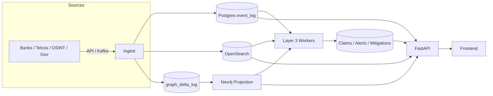

# Sentinel-KE

Sentinel-KE is an end-to-end cyber intelligence platform built in three layers:

- Layer 1: Evidence-grade ingestion into Postgres (canonical truth) + OpenSearch indexing
- Layer 2: Deterministic graph projection to Neo4j (derived view)
- Layer 3: Analytics workers (DDoS, VPN/infra correlation, fraud/mule campaigns, claims, mitigations, AI features)

The system is deterministic, explainable, and replayable. Postgres is always the source of truth.

## Core Principles

- Postgres is canonical; Neo4j is projection-only.
- All intelligence outputs are persisted to Postgres first.
- Graph projections are generated via GraphDelta logs.
- PII never enters the graph; sensitive identifiers are pseudonymized.
- Everything is replayable from the ledger.

## End-to-End Data Flow


```mermaid
flowchart LR
    subgraph Sources
        A[Banks / Telcos / OSINT / Gov] -->|API / Kafka| ING[Ingest]
    end

    ING --> LEDGER[(Postgres event_log)]
    ING --> SEARCH[(OpenSearch)]
    ING --> DELTA[(graph_delta_log)]

    DELTA --> NEO4J[Neo4j Projection]

    LEDGER --> L3[Layer 3 Workers]
    SEARCH --> L3
    NEO4J --> L3

    L3 --> INTEL[(Claims / Alerts / Mitigations)]

    LEDGER --> API[FastAPI]
    SEARCH --> API
    NEO4J --> API
    INTEL --> API

    API --> UI[Frontend]
```

## Quick Start (minimal)

1) Start the stack:
```
docker compose up -d
```

2) See the runbook for demo data, workers, and endpoint usage:
```
docs/RUNBOOK.md
```

Delivery tracker (5 phases to 90% readiness):
```
docs/PHASES_90_TRACKER.md
```

## What’s Implemented

- Ingestion with strict validation and pseudonymization
- Event ledger and entity index in Postgres
- OpenSearch indexing + timeline/search APIs
- GraphDelta logging and Neo4j projection worker
- DDoS alert worker (structural signals)
- VPN/infra cluster worker (endpoint overlap + provider/time overlap)
- Fraud demo + mule-ring campaign worker (SIM swap -> login -> transfers -> cashout)
- Campaign claims + risk suggestions
- Mitigation/IOC bundles + export
- AI feature snapshots + embeddings + predictions + explanations (lightweight, deterministic)
- Metrics + readiness endpoints

## National Backbone Roadmap (High Level)

The goal is a security and economic integrity backbone that can serve every sector and scale across Africa.

### Pillar A: National Security and Defense

- National asset registry for critical infrastructure
- Continuous risk scoring for assets, agencies, and sectors
- Threat intelligence fusion (global + local)
- Campaign correlation across sources and time windows
- Graph intelligence core for entities and relationships
- Cross-sector anomaly detection and escalation
- Incident workflow engine (triage, assign, track)
- Evidence chain-of-custody for legal defensibility
- Playbook automation for common response paths
- Early warning system with confidence signals
- Alert explainability and evidence summaries
- National cyber drills simulator
- Forensic evidence export (court-ready)
- Infrastructure sabotage alerts (energy, water, transport)
- Cross-border collaboration hub

### Pillar B: Economic Integrity and Anti-Leakage

- Economic leakage detection across public systems
- Procurement anomaly scoring (tenders, vendors, pricing)
- Budget integrity checks (plan vs spend vs delivery)
- Cross-agency audit correlations
- Asset misuse detection (public assets and fleets)
- Corruption risk indicators and audits
- Illicit flow monitoring (cross-border patterns)
- Tax base leakage analysis
- Supply chain integrity maps
- Critical service availability monitor
- Fraud and abuse pattern engine (payments, subsidies)
- Public safety analytics (crime + cyber + finance)
- Cattle rustling risk monitoring with geo signals
- Geo-risk modeling and hotspot alerts
- Economic impact estimator for incidents

### Platform Foundations

- Sector-agnostic data exchange layer
- Unified event schema with versioning
- Data provenance ledger and lineage tracking
- Zero-trust access model
- Role-based access control (agency and sector)
- Multi-tenant isolation with hard boundaries
- Data minimization and retention controls
- Privacy-preserving analytics (aggregation, pseudonymization)
- Data quality scoring and freshness indicators
- Data reconciliation across agencies
- Secure DevSecOps pipeline (signed builds, SBOMs)
- Tamper-evident audit logging
- Multi-cloud and on-prem deployment support
- API gateway + connector SDKs
- Observability across data pipelines and services

### AI and Analytics

- Risk scoring with confidence bands
- Explainable AI outputs (human-readable evidence)
- Human-in-the-loop validation for high impact decisions
- Bias and fairness monitoring
- Model registry and version governance
- Simulation sandbox for model testing
- Feature store for reusable signals
- Predictive scenario modeling
- National trust index (aggregate risk signal)
- Executive briefing generation

### Governance, Adoption, and Export

- National data trust governance model
- Policy compliance dashboards
- National incident reporting portal
- Public-private sharing gateway
- Multi-language reporting (regional accessibility)
- Training and certification platform
- Research collaboration bridge (universities, labs)
- Maturity assessment tool for agencies
- Outcome tracking metrics (loss reduction, uptime)
- Sector onboarding toolkit
- Interoperability standards (STIX/TAXII + custom)
- Data marketplace framework
- API monetization layer
- Export-ready compliance pack (ISO, NIST, IEC 62443)

## Current Implementation vs Roadmap (High Level)

Rough coverage estimate: ~25% of the roadmap is implemented, focused on core data pipelines, graph, and initial analytics.

Implemented or partially implemented today:
- Canonical ingestion pipeline with validation, pseudonymization, and ledger
- OpenSearch indexing and search/timeline APIs
- Graph delta logging and Neo4j projection
- Campaign correlation engine (fraud/mule demo)
- DDoS analytics and infra clustering
- Mitigation/IOC bundles and export
- AI feature snapshots and lightweight predictions
- Metrics and readiness endpoints

Not implemented yet (examples from the roadmap):
- Cross-agency data trust governance and policy compliance
- Economic leakage and corruption detection workflows
- Multi-tenant data sharing gateway and marketplace
- National SOC workflows and incident reporting portal
- Export compliance pack and monetization layers

## Repository Layout

- `backend/` FastAPI services, workers, ledger, graph projection
- `frontend/` UI
- `simulator/` demo data generator (scenarios)
- `docs/` runbook and operational notes

## Configuration

Key environment variables (see `.env`):

- `DATABASE_URL`
- `OPENSEARCH_HOST`, `OPENSEARCH_INDEX_EVENTS`
- `NEO4J_URI`, `NEO4J_USER`, `NEO4J_PASSWORD`
- `REDPANDA_BROKERS`
- `INGEST_API_KEY`
- `FRONTEND_API_KEY` (optional API auth key)

## Support

If the UI or workers are not producing alerts, verify:

- events exist in Postgres (`event_log`)
- OpenSearch index has docs
- GraphDelta log is populated
- workers have been run

See `docs/RUNBOOK.md` for step-by-step commands.
